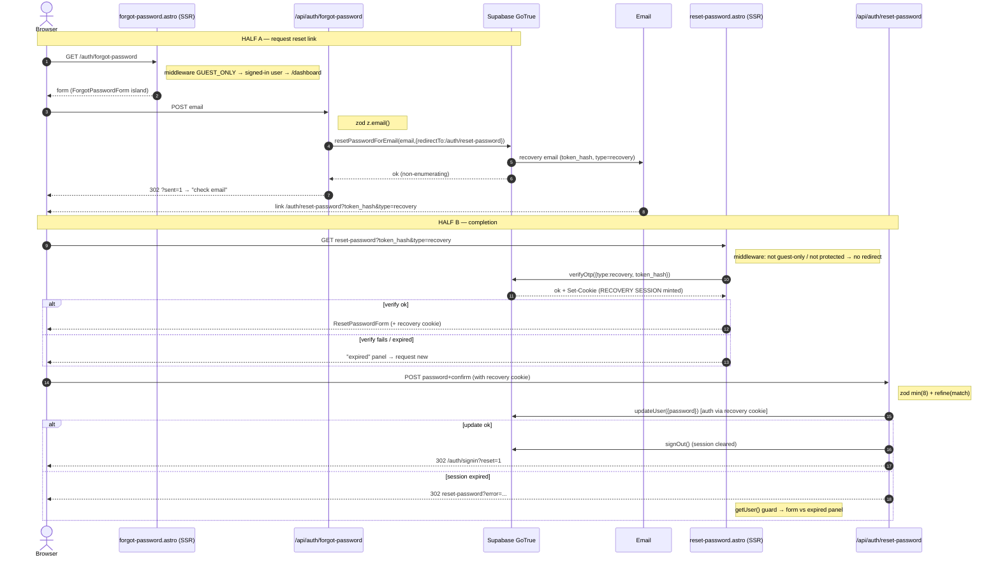

# Research — Password-reset data-flow

> **Cel (Krok 0):** Badam **przepływ resetu hasła** od `src/pages/auth/reset-password.astro` (+ `forgot-password`), bo mapa (`context/map/repo-map.md` §4) wskazała auth/runtime jako jedyną strefę wysokiego ryzyka — najtwardszy coupling (`supabase.ts` fan-in 13 → middleware runtime), bus-factor na fundamencie i jedyny net-new flow z udokumentowanym edge case'em (F1: pułapka wygasłej sesji).

## Research Question

Przeanalizuj przepływ resetu hasła (forgot-password → reset-password) tylko jako stan obecny, z trzema sub-agentami (trace e2e / luki w testach / blast radius), karmiąc je mapą jako priorem. Raport ma dwie jawne sekcje — Feature overview i Technical debt — z rozdziałem evidence / inference / unknown.

**Metoda:** trzy równoległe sub-agenty (read-only); rdzeń ścieżki przeczytany w głównym kontekście; każde twierdzenie zakotwiczone w `file:line`. Twierdzenia strukturalne weryfikowane ast-grepem w osobnym przebiegu (patrz §3 na końcu).

---

# ① Feature overview

> Przepływ, nie spis plików: skąd wchodzą dane, kto je waliduje, gdzie zmienia się stan, co wraca.

**Czym jest feature:** dwupołówkowy flow resetu hasła na Astro SSR + React islands + Supabase GoTrue (sesja cookie-based przez `@supabase/ssr`), na Cloudflare Workers. Łącznikiem obu połówek jest **krótkotrwała sesja recovery** wstrzykiwana do cookies przez `verifyOtp` i kasowana przez `signOut`. **Feature nie dotyka żadnej tabeli aplikacji** — operuje wyłącznie na zarządzanym przez Supabase `auth.users` (brak migracji, brak regeneracji `database.types.ts`).

### Przepływ danych (skąd → walidacja → stan → co wraca)

**Połówka A — prośba o link:**
1. **Wejście:** `GET /auth/forgot-password` (`forgot-password.astro:8-10`). Middleware najpierw: trasa jest w `GUEST_ONLY_ROUTES` (`middleware.ts:10`) → zalogowany user leci na `/dashboard` (`:32-34`); wylogowany przechodzi.
2. **Dane wchodzą:** pole `email` (`ForgotPasswordForm.tsx:41-52`), POST na `/api/auth/forgot-password`.
3. **Walidacja:** klient — regex + non-empty, `e.preventDefault()` przy błędzie (`ForgotPasswordForm.tsx:17-36`, tylko UX); serwer — zod `z.email()` (`forgot-password.ts:7,13`), błąd → `302 ?error=`.
4. **Zmiana stanu (zewn.):** `supabase.auth.resetPasswordForEmail(email, { redirectTo: origin + "/auth/reset-password" })` (`forgot-password.ts:24,26`). GoTrue generuje token i wysyła mail. Żadna sesja nie jest tu ustawiana.
5. **Co wraca:** `302 ?sent=1` (`:34`) → panel „check email". **Non-enumerujące** — „email nie istnieje" NIE jest rozróżniane, ląduje na tym samym `?sent=1` (`:28-29`).

**E-mail:** `supabase/templates/recovery.html:4` linkuje na `{{ .SiteURL }}/auth/reset-password?token_hash={{ .TokenHash }}&type=recovery` (wpięte przez `config.toml:256-258`). Świadomie `token_hash`+`type` zamiast PKCE `?code=`, żeby **serwer** domknął recovery bez PKCE w przeglądarce (`reset-password.astro:14-16`).

**Połówka B — domknięcie:**
6. **Wejście:** `GET /auth/reset-password?token_hash=…&type=recovery`. Trasa **celowo poza** `PROTECTED_ROUTES` i `GUEST_ONLY_ROUTES` (`middleware.ts:5,10` + komentarz `:7-9`) → brak redirectu w obie strony (link przychodzi bez sesji, a posiadacz sesji recovery musi zostać).
7. **Zmiana stanu (mint sesji):** strona woła `supabase.auth.verifyOtp({ type: "recovery", token_hash })` (`reset-password.astro:22`); sukces → zapis cookies sesji recovery przez `setAll` (`supabase.ts:18-23`), `showForm = !verifyError`. Błąd/wygaśnięcie → panel „expired" (`:53-62`).
8. **Dane wchodzą:** `password` + `confirmPassword` (`ResetPasswordForm.tsx:64-108`), POST na `/api/auth/reset-password`.
9. **Walidacja:** klient — required + min 8 + zgodność (`ResetPasswordForm.tsx:23-40`); serwer — zod `password.min(8)` + `.refine(match)` (`reset-password.ts:11-18`), błąd → `302 ?error=`.
10. **Zmiana stanu (zapis):** `supabase.auth.updateUser({ password })` (`reset-password.ts:39`) — pod autorytetem sesji recovery z cookies. Błąd (np. sesja wygasła) → `302 ?error=`.
11. **Zmiana stanu (drop):** po sukcesie `supabase.auth.signOut()` (`:45`) kasuje cookies sesji recovery — **kolejność istotna: signOut PO updateUser**.
12. **Co wraca:** `302 /auth/signin?reset=1` (`:46`); flaga `?reset=1` konsumowana przez `signin.astro` (poza zestawem plików flow).

### Diagram (Mermaid)

### Edge case'y (z kodu)
- **Token nieważny/wygasły przy verify** → `verifyError` → panel expired, sesja nie powstaje (`reset-password.astro:22-24`).
- **F1 — guard relay błędu:** gdy strona dostaje `?error=` bez `token_hash`, NIE pokazuje ślepo formularza; woła `getUser()` i `showForm = Boolean(user)` (`reset-password.astro:25-36`) — żywa sesja → formularz, wygasła → panel expired (zamiast pętli na formularzu).
- **Non-enumeracja** maila (`forgot-password.ts:28-34`).
- **Supabase nieskonfigurowane** (`createClient → null`, `supabase.ts:7-9`) obsłużone na każdej warstwie.
- **Potrójna walidacja długości hasła**: client + server + `config.toml` (wszystkie 8).

### EVIDENCE / INFERENCE / UNKNOWN (overview)
- **EVIDENCE:** wszystkie wywołania Supabase i redirecty zacytowane wyżej z `file:line`; klucze i18n `auth.*` rozwiązują się w `en.ts`/`pl.ts` (potwierdzone).
- **INFERENCE:** `getUser`-guard istnieje, by uniknąć pętli na wygasłej sesji (zgodne z komentarzem, ale to interpretacja intencji); `?reset=1` zakładamy konsumowane przez `signin.astro`.
- **UNKNOWN:** produkcyjne ustawienia Supabase (rzeczywiste OTP/recovery expiry, refresh-token lifetime = „7-dniowa sesja" z mapy, `enable_confirmations`, allow-lista redirect URL, SMTP) — `config.toml` jest **tylko lokalne**; atrybuty cookies GoTrue (httpOnly/secure/sameSite) ukryte w bibliotece; faktyczna jednorazowość tokenu egzekwowana przez GoTrue, nie w repo.

---

# ② Technical debt

> Zamieniam ogólne „to czuły rejon" na konkretne rodzaje ryzyka i oddzielam dług prawdziwy od taniego (łapanego przez CI).

### Dług PRAWDZIWY (niełapany przez lint/build/CI)

**D1 — F1 (guard wygasłej sesji) ma ZERO pokrycia testowego.** [test gap]
Naprawiona w impl-review gałąź `reset-password.astro:25-36` (`else if (error)` + `getUser`) nie jest dotykana przez żaden test. E2E happy-path nie POST-uje błędnego hasła po wygaśnięciu sesji; e2e junk-token idzie gałęzią `verifyOtp` (`:19-24`), nie relay-error. **Revert do `showForm = Boolean(error)` przejdzie wszystkie suity na zielono.** Dokładnie ten edge case, który mapa wskazała jako sygnaturę ryzyka. To najwyższy priorytet. *Evidence: brak asercji w `tests/e2e/password-reset.spec.ts`; komentarz `:101-102` wprost: „handler tests can't reach it".*

**D2 — poczwórna prawda o długości hasła + zgniły komentarz.** [fragile coupling] *(ast-grep: doprecyzowane — gorzej niż w trace)*
`MIN_PASSWORD_LENGTH = 8` jest zdefiniowane w **4 miejscach** bez pojedynczego źródła: `reset-password.ts:7`, `ResetPasswordForm.tsx:9`, **`SignUpForm.tsx:9`** (ast-grep ujawnił trzecią definicję TS poza flow resetu) oraz `config.toml:190` (`minimum_password_length = 8`). Drift **już wystąpił**: komentarz `reset-password.ts:9` mówi „min 6", a komentarz nagłówkowy testu (`reset-password.test.ts:8`) też pisze „password min 6" — choć faktyczny kontrakt to 8 (potwierdzone grepem: dokładnie te 2 zgniłe komentarze). Lint/build/typecheck tego nie złapią (komentarze + wartość w TOML poza systemem typów). Rozjazd config↔kod = realne ryzyko regresji floor'a bezpieczeństwa.

**D3 — kontrakt URL linku resetu jest string-only, rozrzucony na ≥4 miejsca.** [fragile coupling / hidden] *(ast-grep/grep: doprecyzowane)*
Kształt `/auth/reset-password?token_hash=…&type=recovery` to niejawny kontrakt łączący **producentów** — `recovery.html:4` (link maila) i `forgot-password.ts:24` (`redirectTo`) — z **konsumentem** `reset-password.astro:11-22` (czyta `token_hash`+`type` z `searchParams`, nie literałem) oraz **testami** `tests/e2e/support/mailpit.ts:23,25` (komentarz + regex) i `tests/e2e/password-reset.spec.ts:65,103`. Żaden plik nie importuje pozostałych — zmiana jednego cicho psuje resztę, niełapane statycznie. Co-change z gita potwierdza sprzężenie (config.toml 3×, recovery.html 1× w commitach recovery), którego graf statyczny NIE pokazuje.

**D4 — parytet i18n en/pl maskowany cichym fallbackiem.** [latent]
Flow „posiada" ~19 kluczy `auth.*`. Fallback `t()` (`i18n/index.ts:14-17`) po cichu wraca do en przy braku klucza pl → brak klucza nie wywala buildu, tylko po cichu pokazuje angielski. **Obecnie parytet PASS** (oba katalogi pełne), ale brak jakiegokolwiek strażnika; zgodne z klastrem B z mapy („en bez pl" = najczęstszy ukryty dług).

**D5 — wykluczenie `reset-password` z `GUEST_ONLY_ROUTES` nie jest przypięte testem.** [latent]
Happy-path e2e działa tylko dlatego, że sesja recovery nie odbija na `/dashboard`, ale żaden test wprost tego nie pinuje (`middleware.ts:10`). Regresja dodająca trasę do guest-only ujawni się jako mylący błąd e2e, nie celowany.

### Dług NIEPEWNY / poza repo (unknown)

**D6 — dryf konfiguracji produkcyjnej.** `config.toml` konfiguruje wyłącznie dev (Mailpit, `site_url=localhost`). Prod `site_url`, `additional_redirect_urls`, szablon recovery, SMTP i refresh-token lifetime żyją w dashboardzie Supabase — **bez artefaktu w repo** (komentarze `config.toml:159-160,224-226`). Zmiana ścieżki/​szablonu wymaga ręcznej aktualizacji prod, niewidocznej w git. To pogłębia D1: jeśli e2e **nie jest** w CI (do potwierdzenia — `.github/workflows/ci.yml` opisane jako lint+build), to całe pokrycie `.astro`/wysp jest lokalne, a faktyczny floor CI dla flow to same unit-handlery → ryzyko D1 rośnie.

### Dług TANI / łapany przez CI (świadomie odróżniony — NIE priorytet)
- **Luki walidacji klienckiej** (required/min/regex/mismatch w obu formularzach, `clearError`, `passwordHint`) są nietestowane, ale **każde odrzucenie ma serwerowy mirror w zod, który JEST pokryty unit-testami** (`forgot-password.test.ts:31-93`, `reset-password.test.ts:33-93`). Floor bezpieczeństwa trzyma; brakuje tylko asercji UX → niski priorytet.
- **Niezgodności typów / brakujące importy** złapie `astro check` + `lint` + `build` (bramki CI z CLAUDE.md). Nie liczę jako dług.
- **F4 (kolejność signOut) — ZAMKNIĘTE:** `reset-password.test.ts:68` pinuje `invocationCallOrder`. Nie jest już długiem.

### Co JEST dobrze pokryte (kontekst, nie dług)
Wszystkie serwerowe gałęzie obu route'ów (zod/error/non-enumeracja/unconfigured) — unit. `verifyOtp` sukces i błąd w `reset-password.astro` — e2e (`password-reset.spec.ts:69-71`, `:100-107`). Pełny happy-path request→Mailpit→verify→set→signin — e2e (`:44-98`). Integration (`test/integration/*`) to wyłącznie RLS `flashcards` — nie dotyka tego flow (poprawnie, bo flow nie rusza tabel app).

---

## Code References

- `src/pages/api/auth/forgot-password.ts:7,13,24,26,28-34` — zod email, redirectTo, resetPasswordForEmail, non-enumeracja.
- `src/pages/api/auth/reset-password.ts:7,11-18,39,45,46` — MIN_PASSWORD_LENGTH, zod, updateUser, signOut, redirect `?reset=1`.
- `src/pages/auth/reset-password.astro:19-24,25-36,53-62` — verifyOtp mint, F1 getUser-guard, panel expired.
- `src/pages/auth/forgot-password.astro:17-25` — panel „sent" vs formularz.
- `src/lib/supabase.ts:6-25` — `createClient(headers, cookies)`, fan-in 13, null gdy brak env.
- `src/middleware.ts:5,10,32-40` — PROTECTED vs GUEST_ONLY (reset celowo poza obiema).
- `supabase/templates/recovery.html:4` + `config.toml:190,256-258` — kontrakt linku + długość hasła + wpięcie szablonu.
- `tests/e2e/password-reset.spec.ts:44-107`, `test/handlers/{forgot,reset}-password.test.ts` — pokrycie.
- `tests/e2e/support/mailpit.ts:25` — regex linku resetu (4. punkt kontraktu URL).

## Architecture Insights
- Cienkie kontrolery API delegujące do Supabase; cała logika sesji recovery żyje w warstwie SSR `.astro` (mint via verifyOtp) — co czyni ją testowalną tylko przez e2e (źródło D1).
- `createClient` to jedyny szew danych/auth (fan-in 13); zmiana jego *kontraktu sesji* (model recovery cookie) promieniuje na middleware + 10 route'ów.
- Flow nie ma modelu danych — operuje na `auth.users` GoTrue; brak migracji/`database.types.ts` w blast radius.

## Historical Context (from prior changes)
- `context/archive/2026-06-21-account-access-recovery/` — flow zbudowany tu (FR-006, jedyny net-new auth flow). `reviews/impl-review.md`: F1 (pułapka wygasłej sesji — naprawiona, ale patrz D1), F3 (długość hasła — podbita do 8, patrz D2), F4 (kolejność signOut — zamknięta testem).
- `context/archive/2026-06-23-post-login-redirect/change.md` — decyzja o `GUEST_ONLY_ROUTES` i celowym wykluczeniu reset/confirm (źródło D5).
- `context/map/repo-map.md` §4 — prior strefy ryzyka, który skierował ten research.

## Open Questions
1. **Czy e2e biegnie w CI?** (`.github/workflows/ci.yml`) — determinuje, czy D1 jest ryzykiem lokalnym czy produkcyjnym.
2. Czy prod używa tego samego `recovery.html` i jakie są prod redirect URLs / refresh-token lifetime (D6).
3. Czy warto wyciągnąć MIN_PASSWORD_LENGTH do jednego źródła współdzielonego z `config.toml` (D2).

---

# ③ Weryfikacja twierdzeń strukturalnych (ast-grep)

> Narzędzie: `@ast-grep/cli` 11.13.0 (uruchamiane `npx --package @ast-grep/cli ast-grep`, bez dodawania do `package.json`). Reguła lekcji zastosowana: **liczę ast-grepem dla precyzji, każde zero potwierdzam klasycznym grepem**, żeby odróżnić realny brak od złego wzorca. Ograniczenie: ast-grep nie parsuje `.astro` — twierdzenia o frontmatter `.astro` weryfikowane grepem.

| # | Twierdzenie (z raportu) | Werdykt | Dowód |
|---|---|---|---|
| T1 | `createClient` fan-in = **13 importerów** | **potwierdzone** | grep importów (all ext): 11×`.ts` + 2×`.astro` (`reset-password.astro`, `dashboard.astro`) = 13. ast-grep: 13 call-site'ów w 11 plikach `.ts` (`cards.ts`, `cards/[id].ts` wołają 2×) |
| T2 | `@/i18n` fan-in = **24** | **potwierdzone** | grep: 24 importery (all ext) |
| T3 | `verifyOtp` „tylko w `reset-password.astro`" | **potwierdzone** | grep: 1 wywołanie `reset-password.astro:22` (+2 wzmianki w komentarzach). ast-grep `--lang ts` = 0 → **potwierdzone grepem jako realny brak w `.ts`** (żyje w `.astro`), nie zły wzorzec |
| T4 | `updateUser` tylko w `reset-password.ts` | **potwierdzone** | ast-grep `$O.auth.updateUser($$$)`: jedyne `reset-password.ts:39` |
| T5 | `resetPasswordForEmail` tylko w `forgot-password.ts` | **potwierdzone** | ast-grep: jedyne `forgot-password.ts:26` |
| T6 | `signOut` — kontekst flow | **doprecyzowane** | ast-grep: **2** call-site'y — `reset-password.ts:45` (flow) **oraz** `signout.ts:7` (osobny endpoint). Flow ma 1, ale „signOut" nie jest unikalne dla resetu |
| T7 | `MIN_PASSWORD_LENGTH = 8` w „3 miejscach" | **obalone → gorzej** | ast-grep: **3** definicje TS (`reset-password.ts:7`, `ResetPasswordForm.tsx:9`, `SignUpForm.tsx:9`) + `config.toml:190` = **4 łącznie**. Patrz D2 |
| T8 | Zgniłe komentarze „min 6" | **potwierdzone** | grep: dokładnie 2 — `reset-password.ts:9`, `reset-password.test.ts:8` |
| T9 | Fan-in prymitywów: FormField/SubmitButton/ServerError → 4, PasswordToggle → 3, **BackHome → 5** | **potwierdzone** (po korekcie) | grep dał najpierw `BackHome → 0` — **fałszywe zero**: import ma sufiks `.astro` (`BackHome.astro"`), zły wzorzec. Po poprawce: 5 stron auth. Reszta zgodna |
| T10 | Kontrakt URL `/auth/reset-password` „na 4 miejsca" | **doprecyzowane** | grep: producenci `recovery.html:4`, `forgot-password.ts:24`; konsument `reset-password.astro` (przez `searchParams`, nie literał); testy `mailpit.ts:23,25` + `password-reset.spec.ts:65,103`. Sprzężenie potwierdzone, punktów ≥4 |
| T11 | Parytet i18n en/pl (D4) | **potwierdzone** | `comm` na kluczach `auth.*`: **45 = 45, różnica symetryczna pusta** — parytet trzyma (ale wciąż maskowany fallbackiem `index.ts:14-17`) |

**Metawniosek z weryfikacji:** dwa „zera" okazały się artefaktami narzędzia, nie kodu — (a) ast-grep `--lang ts` na `verifyOtp/updateUser` dało 0 przez błędne wywołanie `npm exec` (wieloplikowy bin), wykryte i naprawione przez grep; (b) `BackHome → 0` to zły wzorzec grepa (sufiks `.astro`). Oba potwierdzają regułę: **każde zero waliduj drugim narzędziem.** Jedna korekta merytoryczna wzmacnia dług (T7 → D2: 4 definicje stałej zamiast 3).
